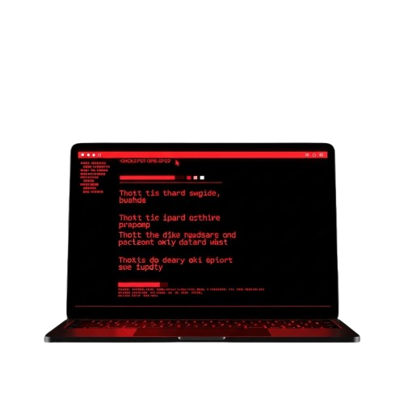
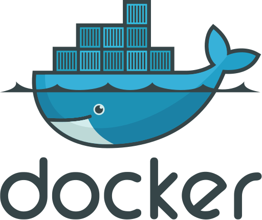

<div align="center">


**v7.1 — Web Vulnerability Scanner & Recon Suite**

[](https://python.org)
[](https://go.dev)
[](https://flask.palletsprojects.com)
[](https://playwright.dev)
[](https://ai.google.dev)
[](https://docker.com)
[]()
[](LICENSE)

> *"O codigo que voce nao testou e o ataque que voce nao viu vir."*

</div>

---

## O que e o CyberDyne

Scanner de seguranca web all-in-one. Um unico arquivo Python, zero binarios obrigatorios. Reconhecimento, 150+ testes de vulnerabilidade, fuzzing Go turbo, browser real com Playwright, IA generativa para payloads, OOB detection, WAF evasion adaptativo e relatorios PDF executivos. Aponte e dispare.

Nasceu como resposta ao **Vibe Coding** — desenvolvimento acelerado por IA que produz codigo funcional mas inseguro.

```
python CyberDyneWeb.py --url https://alvo.com --all -o meu_projeto
```

<div align="center">

https://github.com/user-attachments/assets/16df8ab2-839d-498b-a3db-69d66cef4c0f

</div>

---

<div align="center">

## Reconhecimento — Fase 1


</div>

13 etapas automaticas de coleta de inteligencia antes de qualquer teste:

| # | Etapa | O que faz |
|---|---|---|
| 1 | **Subdominios** | 6 fontes: crt.sh, HackerTarget, Wayback, VirusTotal, SecurityTrails, Chaos |
| 2 | **Coleta de URLs** | ParamSpider + OTX AlienVault + Common Crawl + Crawl HTML depth=2 |
| 3 | **Validacao de URLs** | HEAD+GET em 30 threads, filtra ativas (200-399) |
| 4 | **Subdomain Takeover** | Fingerprints EdOverflow + CNAME dangling detection |
| 5 | **WHOIS** | Raw socket 2-fases (IANA → TLD): registrar, datas, nameservers, DNSSEC |
| 6 | **Fingerprint** | 114+ tecnologias, 15 categorias, 8 vetores (Wappalyzer-style, implies/excludes) |
| 7 | **Emails** | Scraping + Hunter.io + HIBP (vazamentos) |
| 8 | **Port Scan** | Top-140 portas via socket (ou Go Engine com 500 goroutines via `--go`) |
| 9 | **GitHub Dorking** | Secrets em commits publicos + 80 dorks extras |
| 10 | **AI Fingerprint** | Detecta endpoints de IA/BaaS (OpenAI, Supabase, Firebase, Anthropic) |
| 11 | **Fuzzing Paths** | 12 wordlists + K8s + IaC, 15 threads (~1000+ paths) ou Go Turbo (200 goroutines) |
| 12 | **LinkFinder** | Endpoints e secrets em arquivos JS (5 regex + 30 patterns, filtra Supabase anon keys) |
| 13 | **Shodan** | Portas, CVEs, organizacao, hostnames pelo IP |

---

<div align="center">

## Vulnerabilidades — Fase 2


</div>

118 checks em 8 grupos paralelos. Cada check com confidence score (0-100%), baseline diff, contra-prova e canary injection para reducao de falsos positivos.

### OWASP Top 10 + Extended (001-020)

| # | Vulnerabilidade | Severidade | CVSS |
|---|---|---|---|
| 001 | SQL Injection Error-based (140 patterns, 30+ DBMS, baseline diff) | CRITICO | 9.8 |
| 002 | SQL Injection Time-based Blind (contra-prova SLEEP(0)) | CRITICO | 9.8 |
| 003 | XSS Reflected (8 fases, 80+ payloads, encoding check, context filter) | ALTO | 6.1 |
| 004 | XSS Stored (POST + GET verification) | ALTO | 6.1 |
| 005 | XSS DOM-based (13 sources x 19 sinks, proximity analysis) | ALTO | 6.1 |
| 006 | CSRF (ausencia de token em forms POST) | MEDIO | 4.3 |
| 007 | SSRF (23 param names + cloud metadata + OOB callback) | CRITICO | 9.1 |
| 008 | LFI / Path Traversal (regex exato /etc/passwd, ≥3 linhas) | CRITICO | 9.8 |
| 009 | RFI (canary + baseline) | CRITICO | 9.8 |
| 010 | Command Injection (canary echo CYBERDYNE_xxx, contra-prova) | CRITICO | 9.8 |
| 011 | XXE (XML entity injection + OOB) | ALTO | 7.5 |
| 012 | Open Redirect (44 payloads, CDN ignore list, destino final check) | MEDIO | 6.1 |
| 013 | Insecure Deserialization (magic bytes Java/Python/PHP) | CRITICO | 9.8 |
| 014 | Security Misconfiguration | MEDIO | 5.3 |
| 015 | Broken Access Control | ALTO | 8.2 |
| 016 | Cryptographic Failures (TLS fraco, HTTP sem redirect) | ALTO | 7.5 |
| 017 | Vulnerable Components (versoes desatualizadas) | ALTO | 7.5 |
| 018 | Insufficient Logging | MEDIO | 4.0 |
| 019 | IDOR (IDs sequenciais em APIs) | ALTO | 7.5 |
| 020 | Mass Assignment (campos extras aceitos) | ALTO | 7.5 |

### IA / JWT / Auth (021-035)

| # | Vulnerabilidade | Severidade | CVSS |
|---|---|---|---|
| 021 | JWT Signature Bypass (alg:none + null sig + claim comparison) | CRITICO | 9.8 |
| 022 | JWT Weak Secret (330+ senhas, HS256/384/512, prova criptografica) | CRITICO | 9.8 |
| 023 | JWT Advanced (JWKS + KID injection/SQLi + claim tampering) | CRITICO | 9.8 |
| 024 | Prompt Injection (35 payloads, homoglyph + base64 mutations) | ALTO | 8.1 |
| 025 | LLM Data Leakage | ALTO | 7.5 |
| 026 | Race Condition (concurrent requests) | ALTO | 8.1 |
| 027 | Prototype Pollution (canary unico + endpoint diferente) | ALTO | 7.5 |
| 028-029 | GraphQL Security (introspection + DoS + suggestions + trace) | ALTO | 7.5 |
| 030 | API Rate Limit ausente | MEDIO | 5.3 |
| 031 | Stack Trace / Debug Mode | MEDIO | 5.3 |
| 032 | Metrics expostos (/metrics, /actuator) | MEDIO | 5.3 |
| 033 | CORS Misconfiguration | ALTO | 7.5 |
| 034 | WebSocket sem autenticacao | ALTO | 7.5 |
| 035 | SSTI (contra-prova {{8*8}}=64 confirma execucao) | CRITICO | 9.8 |

### BaaS / Cloud (036-045)

| # | Vulnerabilidade | Severidade | CVSS |
|---|---|---|---|
| 036 | Supabase RLS Audit (60+ tabelas + storage + RPC + JWT decode) | CRITICO | 9.8 |
| 037 | Firebase Rules abertas + API key + Storage | CRITICO | 9.1 |
| 038 | S3 Bucket publico | CRITICO | 9.1 |
| 039 | Cognito Misconfiguration | ALTO | 7.5 |
| 040-045 | AWS/Stripe/SendGrid/Twilio/Google keys expostas | CRITICO | 9.1 |

### Recon / DNS (046-055)

| # | Vulnerabilidade | Severidade | CVSS |
|---|---|---|---|
| 046 | Subdomain Takeover | ALTO | 8.2 |
| 047 | DNS Zone Transfer (AXFR) | ALTO | 7.5 |
| 048-049 | SPF/DMARC ausente ou fraco | MEDIO | 5.3 |
| 050-054 | Git/SVN/.DS_Store/Backups/Source Maps expostos | ALTO | 7.5 |
| 055 | Wayback JS Leakage (secrets em JS historico) | ALTO | 7.5 |

### Infra / Headers (056-075)

| # | Vulnerabilidade | Severidade | CVSS |
|---|---|---|---|
| 056 | Host Header Injection (context-aware: href/action/Location) | ALTO | 7.5 |
| 057 | HTTP Request Smuggling (CL.TE, confirmacao manual) | CRITICO | 9.8 |
| 058-060 | HTTP Splitting + Cache Poisoning (clean request verify) + Cache Deception | ALTO | 7.5 |
| 061-067 | Headers ausentes (CORS, Clickjacking, CSP, HSTS, MIME, Referrer, Permissions) | MEDIO | 4.3-6.1 |
| 068-069 | Server/X-Powered-By versionados | BAIXO | 2.6 |
| 070-075 | HTTP Methods perigosos + Directory Listing + Admin Panels + API Auth + Swagger | MEDIO-ALTO | 5.3-7.5 |

### Logica / Autenticacao (076-100)

| # | Vulnerabilidade | Severidade | CVSS |
|---|---|---|---|
| 076 | Broken Auth (credenciais comuns + deteccao de dashboard) | CRITICO | 9.8 |
| 077 | File Upload sem restricao (canary + acesso ao arquivo) | CRITICO | 9.8 |
| 078-082 | Cookies inseguros + Account Enum + Password Reset + Session Fixation + OAuth | ALTO | 7.5 |
| 083-085 | 2FA Bypass + IDOR API + Business Logic (preco negativo) | ALTO | 7.5-8.1 |
| 086-090 | ReDoS + XML Bomb + ZIP Slip + LDAP Injection + XPath Injection | ALTO | 7.5 |
| 091 | NoSQL Injection (JSON record count + timing check) | CRITICO | 9.8 |
| 092-100 | HPP + Default Creds + TLS/SSL + Cert Transparency + Mixed Content + Error Messages + Security.txt | MEDIO-ALTO | 4.3-7.5 |

### Advanced (101-118)

| # | Vulnerabilidade | Severidade | CVSS |
|---|---|---|---|
| 101 | Sensitive Paths (250+ paths paralelos) | ALTO | 7.5 |
| 102 | Swagger/API Docs expostos | MEDIO | 5.3 |
| 103 | HTTP Parameter Pollution | MEDIO | 5.3 |
| 104 | Default Credentials (20 pares em forms) | CRITICO | 9.8 |
| 105 | Deserialization RCE (magic bytes + endpoints RPC) | CRITICO | 9.8 |
| 106 | Web Cache Deception (.css/.js em URLs privadas) | ALTO | 7.5 |
| 107 | JS Secrets (14 tipos + 13 patterns regex) | ALTO | 7.5 |
| 108 | SQL Injection Boolean Blind (contra-prova AND 2=2) | CRITICO | 9.8 |
| 109 | SQL Injection UNION | CRITICO | 9.8 |
| 110 | GraphQL CSRF | ALTO | 8.1 |
| 111 | WAF Bypass (120 payloads x 5 zones x 5 encodings) | ALTO | 7.5 |
| 112 | 403 Bypass (path + header + method mutation) | ALTO | 7.5 |
| 113 | JS Libraries Vulneraveis (Retire.js-style, 27 libs, CVE correlation) | ALTO | 7.5 |
| 114 | Null Byte Injection (regex exato /etc/passwd) | ALTO | 7.5 |
| 115 | Format String Vulnerability (contra-prova offset diferente) | ALTO | 7.5 |
| 116 | Second-Order SQL Injection (payload fragment check) | CRITICO | 9.8 |
| 117 | Log4Shell (JNDI, exige --oob para confirmacao) | CRITICO | 9.8 |
| 118 | BOLA API (campo de identidade cross-user) | ALTO | 7.5 |

### Fase 2.5 — Browser Mimic (opcional)

Chromium real com anti-fingerprinting, mouse Bezier e digitacao humana. Testa vulnerabilidades **client-side**:

| # | Vulnerabilidade | Severidade | CVSS |
|---|---|---|---|
| 201 | DOM XSS Real (execucao JS confirmada via console) | CRITICO | 9.6 |
| 202 | AI-Output Injection (HTML malicioso em chat bots) | ALTO | 8.1 |
| 203 | Prototype Pollution (page.evaluate confirma Object.prototype alterado) | ALTO | 7.5 |
| 204 | Storage Leak (JWT, AWS, Stripe em localStorage/sessionStorage) | ALTO | 7.5 |
| 205 | SPA Hidden Routes (rotas admin em React/Next/Vue/Angular) | ALTO | 8.2 |
| 206 | Clickjacking Real (iframe real — X-Frame-Options testado na pratica) | MEDIO | 6.1 |
| 207 | WebSocket Hijacking (cross-origin + Origin validation) | ALTO | 7.5 |
| 208 | Service Worker Spy (escopo, interceptacao de requests) | ALTO | 7.5 |
| 209 | Clipboard Hijacking (copy event listener malicioso) | MEDIO | 5.3 |
| 210 | Form Autofill Theft (inputs cc-number/password ocultos) | ALTO | 7.5 |
| 211 | CSP Bypass Real (unsafe-inline, unsafe-eval detectados) | ALTO | 7.5 |
| 212 | Cookie Theft via JS (session cookies sem HttpOnly) | ALTO | 7.5 |
| 213 | Keylogger Detection (keydown/keypress listeners no DOM) | ALTO | 8.1 |
| 214 | Redirect Chain (dominios suspeitos / HTTP no meio) | MEDIO | 5.3 |
| 215 | Shadow DOM Leak (shadow roots open com dados sensiveis) | MEDIO | 5.3 |
| 216 | Network Exfiltration (API calls suspeitas via page.route) | ALTO | 7.5 |
| 217 | DOM Clobbering (propriedades window sobrescritas via id/name) | ALTO | 7.5 |

### Fase 2.6 — WordPress Security Audit (--wp)

| # | Vulnerabilidade | Severidade |
|---|---|---|
| 301 | Versao WordPress Exposta (meta generator, feed, readme) | MEDIO |
| 302 | WordPress Core com CVE ativo | CRITICO |
| 303 | Enumeracao de Usuarios (REST API + sitemap + login) | ALTO |
| 304 | Plugin Vulneravel (CVE via Vulners/NVD) | ALTO |
| 305 | XMLRPC Ativo (brute-force + DoS via multicall) | ALTO |
| 306 | Tema Vulneravel (CVE correlation) | ALTO |
| 307 | XMLRPC User Brute-Force | ALTO |
| 308 | Login Username Enumeration | MEDIO |
| 309 | Debug Log Exposto (/wp-content/debug.log) | CRITICO |
| 310 | WP-Cron Exposto (DoS via requisicoes ilimitadas) | MEDIO |
| 311 | Directory Listing (wp-content/uploads/) | MEDIO |
| 312 | Registro Aberto ao Publico | MEDIO |
| 313 | Backup do wp-config Exposto (.bak, .old, .tmp) | CRITICO |
| 314 | REST API Sem Restricao (/wp-json/ publico) | BAIXO |
| 315 | Arquivos de Informacao Expostos (readme.html, etc.) | BAIXO |

---

<div align="center">

## Relatorios — Fase 3 (Final)


</div>

| Arquivo | Descricao |
|---|---|
| `CyberDyneWeb_Report.pdf` | Relatorio executivo: capa dark, risk gauge, confidence badges, vuln cards com curl/request/response, Prova Manual, secao WordPress, sumario Gemini AI |
| `Recon.pdf` | Reconhecimento consolidado: WHOIS, portas, Shodan, emails, subdominios, fuzzing, LinkFinder |
| `prompt_recall.md` | Prompt direto para agente de IA corrigir as vulnerabilidades (gerado por Gemini) |
| `Recon.md` | Mesmos dados do Recon.pdf em Markdown |
| `wp_audit.json` | Dados brutos do WordPress Audit (plugins, temas, users, CVEs, findings) |
| `raw_results.json` | Dados brutos de todos os 150+ checks com confidence scores |

---

<div align="center">

## API Keys (Opcionais)


</div>

Copie `.env.example` para `.env`. Sem chaves, o script roda normalmente — apenas pula os modulos que dependem de API.

| API | Variavel | O que ativa |
|---|---|---|
| **Gemini** | `GEMINI_API_KEY` | Sumario executivo AI + prompt_recall + `--ai-payloads` |
| **OpenAI** | `OPENAI_API_KEY` | Fallback para Gemini (payloads + sumario) |
| **Shodan** | `SHODAN_API_KEY` | Portas, servicos, CVEs pelo IP |
| **VirusTotal** | `VIRUSTOTAL_API_KEY` | Subdominios indexados |
| **SecurityTrails** | `SECURITYTRAILS_API_KEY` | Historico DNS + subdominios |
| **Chaos** | `CHAOS_API_KEY` | Subdominios (ProjectDiscovery) |
| **Hunter.io** | `HUNTER_API_KEY` | Emails corporativos |
| **HIBP** | `HIBP_API_KEY` | Emails vazados em breaches |
| **GitHub** | `GITHUB_TOKEN` | Dorking por secrets em commits |
| **NVD** | `NVD_API_KEY` | CVEs do NIST (correlation de versoes) |
| **Vulners** | `VULNERS_API_KEY` | CVE lookup por software/versao |

---

<div align="center">

## Instalacao e Execucao



</div>

### Instalacao Rapida

```bash
git clone https://github.com/seu-usuario/CyberDyne
cd CyberDyne
pip install -r requirements.txt
cp .env.example .env     # configure suas API keys
```

### Go Turbo Engine (opcional — 10-50x mais rapido)

O Go Engine adiciona fuzzing com 200 goroutines, port scan com 500 goroutines, JS mining, subdomain takeover check e parameter discovery — tudo em paralelo.

**Requisitos:** [Go 1.22+](https://go.dev/dl/) instalado e no PATH.

```bash
# 1. Verificar instalacao do Go
go version
# Deve retornar: go version go1.22+ ...

# 2. Compilar o binario dentro do projeto
cd recon_go
go build -o ../cyberdyne-recon.exe .    # Windows
# go build -o ../cyberdyne-recon .      # Linux/macOS
cd ..

# 3. Verificar que o binario esta na raiz do projeto
ls cyberdyne-recon*
# Deve mostrar: cyberdyne-recon.exe (ou cyberdyne-recon)

# 4. Testar
python CyberDyneWeb.py --url https://example.com --all --go --low -o teste_go
```

> O binario `cyberdyne-recon.exe` deve ficar na **raiz do projeto** (mesmo diretorio que `CyberDyneWeb.py`). O script detecta automaticamente. Nao suba o `.exe` para o GitHub — ele ja esta no `.gitignore`.

### Playwright / Browser Mimic (opcional)

```bash
pip install playwright playwright-stealth fake-useragent
playwright install chromium
```

### Termux (Android)

```bash
pkg update && pkg upgrade -y
pkg install -y python build-essential libffi openssl git
git clone https://github.com/seu-usuario/CyberDyne && cd CyberDyne
pip install -r requirements.txt
cp .env.example .env && nano .env
termux-wake-lock
python CyberDyneWeb.py --url https://alvo.com --all
```

### Exemplos de Uso

```bash
# Teste rapido de conectividade — 1% dos payloads (~30s)
python CyberDyneWeb.py --url https://alvo.com --all --low -o teste

# Scan completo (padrao 60% payloads)
python CyberDyneWeb.py --url https://alvo.com --all -o meu_projeto

# Reconhecimento rapido — 10% dos payloads
python CyberDyneWeb.py --url https://alvo.com --all --easy -o scan_rapido

# Scan autenticado (login + crawl area logada + sessao persistente)
python CyberDyneWeb.py --url https://alvo.com --login https://alvo.com/login -ul admin@email.com -pl senha --all -o auth_scan

# WordPress completo — audit dedicado
python CyberDyneWeb.py --url https://alvo.com --all --wp -o wp_scan

# Modo stealth (anti-WAF) + AI payloads contextuais
python CyberDyneWeb.py --url https://alvo.com --all --stealth --ai-payloads -o stealth_scan

# Dashboard visual em tempo real
python CyberDyneWeb.py --url https://alvo.com --all --live -o live_scan

# Browser Mimic visivel — assista o Chromium ao vivo (17 checks client-side)
python CyberDyneWeb.py --url https://alvo.com --all --browser-mimic-s -o browser_scan

# Go Turbo — fuzzing + portscan + jsmine + takeover + param discovery
python CyberDyneWeb.py --url https://alvo.com --all --go -o go_scan

# Via Tor — Fase 2 anonima
python CyberDyneWeb.py --url https://alvo.com --all --tor -o tor_scan

# OOB Detection — confirma SSRF/XXE/RCE/Log4Shell blind via callback externo
python CyberDyneWeb.py --url https://alvo.com --all --oob -o oob_scan

# Arsenal maximo — tudo ligado
python CyberDyneWeb.py --url https://alvo.com --login https://alvo.com/login -ul admin -pl senha --all --stealth --ai-payloads --live --browser-mimic-s --wp --insane --go --oob -o full_scan

# Retomar scan interrompido
python CyberDyneWeb.py --resume meu_projeto/.checkpoint.cyb
```

### Todas as Flags

| Flag | Descricao |
|---|---|
| `--url URL` | URL alvo (obrigatorio) |
| `-o NOME` | Nome da pasta de output |
| `--all` | Executa tudo: recon + vuln + relatorios |
| `--recon` | Apenas reconhecimento |
| `--vuln` | Apenas vulnerabilidades |
| `--login URL` | URL do painel de login (sessao persistente na Fase 2, refresh automatico) |
| `-ul` / `-pl` | Credenciais de login (usuario / senha) |
| `--stealth` | Delay aleatorio + rotacao de User-Agent |
| `--ai-payloads` | Gemini/OpenAI gera 15 payloads por contexto (XSS, SQLi, LFI, RCE, SSTI, SSRF) |
| `--live` | Dashboard Flask em `localhost:5000` (viewport fixo, Chart.js em tempo real) |
| `--browser-mimic-s` | Chromium visivel — mouse, digitacao, tudo ao vivo (17 checks client-side) |
| `--browser-mimic-ns` | Chromium headless (background, mais rapido) |
| `--wp` | WordPress Audit — 15 checks (301-315): plugins, temas, users, xmlrpc, CVEs |
| `--go` | Go Engine v2 — 6 modulos paralelos (fuzz, portscan, jsmine, takeover, paramdiscovery, urlvalid) |
| `--tor` | Fase 2 via rede Tor (SOCKS5, circuit refresh a cada 50 requests) |
| `--oob` | Out-of-Band detection via Interactsh (confirma SSRF/XXE/RCE/Log4Shell blind) |
| `--low` | **1%** dos payloads — teste de conectividade ultra-rapido (~30s) |
| `--easy` | **10%** dos payloads — reconhecimento rapido (~2 min) |
| `--medium` | **30%** dos payloads — scan rapido (~5 min) |
| `--hard` | **60%** dos payloads — balanceado (padrao) |
| `--insane` | **100%** dos payloads — arsenal completo (~32K payloads) |
| `--resume FILE` | Retomar de checkpoint `.cyb` |

---

<div align="center">

## Docker



</div>

```bash
# Build leve (~300MB) — Python + Go, sem Playwright
docker compose build cyberdyne

# Scan completo com Go Turbo
docker compose run cyberdyne --url https://alvo.com --all --go -o outputs/scan01

# Build completo (~1.6GB) — Python + Go + Playwright
docker compose build cyberdyne-full

# Scan com Browser Mimic
docker compose run cyberdyne-full --url https://alvo.com --all --go --browser-mimic-ns -o outputs/scan01

# Dashboard --live
docker compose run -p 5000:5000 cyberdyne --url https://alvo.com --all --live -o outputs/scan01
```

> Resultados em `./outputs/`. API keys lidas do `.env` (read-only). Go compila automaticamente no build.

---

## Aviso Legal

> **USE EXCLUSIVAMENTE EM SISTEMAS COM AUTORIZACAO EXPLICITA.**
>
> Uso não autorizado e crime (Lei 12.737/2012 — Brasil / CFAA — USA).
> Indicado para: pentest autorizado, bug bounty, laboratorio, desenvolvimento seguro.

---

<div align="center">

**CyberDyne** — Construido para proteger o que importa.

*"Seguranca nao é um produto. É um processo."* — Bruce Schneier

*v7.1 — 23/03/2026*

</div>
