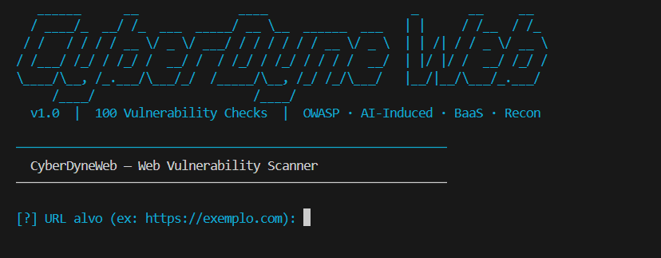

<div align="center">



```
 ██████╗██╗   ██╗██████╗ ███████╗██████╗ ██████╗ ██╗   ██╗███╗   ██╗███████╗
██╔════╝╚██╗ ██╔╝██╔══██╗██╔════╝██╔══██╗██╔══██╗╚██╗ ██╔╝████╗  ██║██╔════╝
██║      ╚████╔╝ ██████╔╝█████╗  ██████╔╝██║  ██║ ╚████╔╝ ██╔██╗ ██║█████╗
██║       ╚██╔╝  ██╔══██╗██╔══╝  ██╔══██╗██║  ██║  ╚██╔╝  ██║╚██╗██║██╔══╝
╚██████╗   ██║   ██████╔╝███████╗██║  ██║██████╔╝   ██║   ██║ ╚████║███████╗
 ╚═════╝   ╚═╝   ╚═════╝ ╚══════╝╚═╝  ╚═╝╚═════╝    ╚═╝   ╚═╝  ╚═══╝╚══════╝
```

**v3.0 — Web Vulnerability Scanner & Recon Suite**

[](https://python.org)
[](LICENSE)
[](requirements.txt)
[]()
[]()

> *"O codigo que voce nao testou e o ataque que voce nao viu vir."*

**CyberDyne** e uma suite de seguranca ofensiva/defensiva em Python puro para encontrar vulnerabilidades em aplicacoes web sem dependencia de ferramentas externas, sem Docker, sem configuracao complexa.

> **v3.0** — 7 ferramentas ofensivas integradas (sqlmap, XSStrike, LinkFinder, graphql-cop, supabase-rls-checker, waf-bypass, prompt-inject-fuzzer) · 111+ checks · Gemini AI para sumario executivo · PDF elegante · Payloads_CY com 18 categorias · 8 APIs OSINT · VulnScanner paralelo (8 grupos)

</div>

---

## Indice

- [Visao Geral](#visao-geral)
- [Stack e Tecnologias](#stack-e-tecnologias)
- [Ferramentas Integradas (v3.0)](#ferramentas-integradas-v30)
- [Instalacao](#instalacao)
- [Como Usar](#como-usar)
- [Fases de Execucao](#fases-de-execucao)
  - [Fase 1 — Recon (13 etapas)](#fase-1--recon-13-etapas)
  - [Fase 2 — 111+ Vulnerability Checks](#fase-2--111-vulnerability-checks)
  - [Fase 3 — Relatorios](#fase-3--relatorios)
  - [Fase 4 — Brute Force Probe](#fase-4--brute-force-probe-opcional)
- [Categorias de Vulnerabilidades](#categorias-de-vulnerabilidades)
- [Fingerprinting de Tecnologias](#fingerprinting-de-tecnologias)
- [API Keys Opcionais](#api-keys-opcionais)
- [Arquivos Gerados](#arquivos-gerados)
- [Aviso Legal](#aviso-legal)

---

## Visao Geral

CyberDyne nasce como resposta ao **"Vibe Coding"** — desenvolvimento acelerado por IA que produz codigo funcional mas inseguro. E um scanner completo, de recon ao relatorio, construido com zero dependencias binarias obrigatorias. Na v3.0, **7 ferramentas ofensivas consagradas** foram portadas e integradas como Python puro — sem instalar nada alem do `pip install`.

```
┌───────────────────────────────────────────────────────────────────┐
│                        CyberDyneWeb.py                           │
│                    ~10.000 linhas · Python puro                  │
│                                                                  │
│  FASE 1           FASE 2           FASE 3           FASE 4       │
│  ┌───────┐        ┌───────┐        ┌───────┐        ┌───────┐   │
│  │ RECON │──────▶│ VULNS │──────▶│RELAT. │──────▶│ BRUTE │   │
│  │Engine │        │ 111+  │        │PDF +  │        │ Force │   │
│  │13 step│        │checks │        │MD+AI  │        │ Probe │   │
│  └───────┘        └───────┘        └───────┘        └───────┘   │
│                                                                  │
│  Single file · Python 3.10+ · 10 pip packages · 0 binarios      │
│  7 ferramentas integradas · 8 APIs OSINT · Gemini AI             │
└───────────────────────────────────────────────────────────────────┘
```

### Principais Recursos

- **Scan Autenticado**: Login com credenciais, crawl atras de autenticacao, cookies injetados globalmente em TODOS os 111+ checks
- **Gemini AI**: Sumario executivo inteligente no PDF + `prompt_recall.md` com fixes tecnicos especificos
- **PDF Elegante**: Capa dark com header, risk gauge, severity badges, vulnerability cards coloridos, numeracao de paginas
- **Payloads_CY**: 18 pastas com payloads especializados (SQLi, XSS, LFI, SSRF, WAF-Bypass, AI-LLM, etc.)
- **8 APIs OSINT**: Gemini, Shodan, VirusTotal, SecurityTrails, Chaos, Hunter.io, HIBP, GitHub
- **8 Grupos Paralelos**: ~14 min vs ~80 min sequencial

---

## Stack e Tecnologias

### Linguagem & Runtime

| Componente | Versao | Uso |
|---|---|---|
| Python | 3.10+ | Runtime principal |
| stdlib `socket` | — | Port scan, WHOIS raw queries |
| stdlib `threading` | — | ThreadPoolExecutor para paralelismo |
| stdlib `ssl` | — | Analise de certificados TLS |
| stdlib `dns.resolver` | via dnspython | Resolucao DNS sem timeout bloqueante |

### Dependencias Python (`requirements.txt`)

| Pacote | Versao Minima | Funcao no Script |
|---|---|---|
| `requests` | 2.31.0 | Todas as requisicoes HTTP |
| `beautifulsoup4` | 4.12.0 | Parsing HTML (forms, hidden inputs, links) |
| `colorama` | 0.4.6 | Terminal colorido (Verde/Vermelho/Amarelo) |
| `reportlab` | 4.0.0 | Geracao do relatorio executivo em PDF |
| `PyJWT` | 2.8.0 | Decodificacao e analise de tokens JWT |
| `dnspython` | 2.4.0 | DNS queries (subdomain takeover, zone transfer) |
| `cryptography` | 42.0.0 | Analise de certificados TLS/SSL |
| `packaging` | 24.0 | Comparacao de versoes de dependencias |
| `python-dotenv` | 1.0.0 | Carregamento de API keys via `.env` |
| `google-generativeai` | 0.4.0 | Integracao com Gemini AI |

---

## Ferramentas Integradas (v3.0)

Na v3.0, **7 ferramentas ofensivas** foram completamente portadas para Python puro e integradas ao CyberDyne. Cada uma foi extraida, adaptada e removida como dependencia externa — o codigo vive dentro do `CyberDyneWeb.py`.

### Ferramentas Portadas para Python Puro

| Ferramenta Original | O que Faz | Substituto Interno |
|---|---|---|
| **sqlmap** | SQL Injection (4 tecnicas) | `check_sqli_classic()` — 140 error patterns (30+ DBMS), `check_sqli_blind()` — time-based multi-DBMS, `check_sqli_boolean()` — true/false comparison, `check_sqli_union()` — ORDER BY + UNION SELECT, `_sqli_tamper()` — WAF bypass (space2comment, randomcase, between, charencode) |
| **XSStrike** | XSS Reflected + DOM | `check_xss_reflected()` — filter checking phase + context-aware payloads (html/attribute/js/comment/bad-tag) + similarity matching + WAF bypass (unicode/encoding), `check_xss_dom()` — variable tracking source-to-sink em inline+external JS |
| **LinkFinder** | JS Endpoint Discovery | `linkfinder_scan()` — regex 5-pattern extraction de arquivos JS, 13 API key/secret patterns, endpoints descobertos alimentam o pipeline de scan |
| **graphql-cop** | GraphQL Security (13 tests) | `check_graphql_introspection()` + batching + csrf — introspection, field suggestions, trace mode, IDE detection, alias overloading, field duplication, directive overloading, circular introspection, batch queries, GET CSRF, mutation CSRF, URL-encoded CSRF |
| **supabase-rls-checker** | Supabase Security Audit | `check_supabase_rls()` — 60+ table RLS testing, storage bucket audit, auth endpoint testing, RPC function probing, service_role key detection com JWT decode |
| **waf-bypass** | WAF Bypass (120 payloads) | `check_waf_bypass()` — 120 bypass payloads em 16 categorias, 5 encoding methods, 5 HTTP zones, WAF vendor detection (CloudFlare, AWS WAF, Akamai, ModSecurity, etc.) |
| **prompt-inject-fuzzer** | AI/LLM Prompt Injection | `check_prompt_injection()` — 35 payloads em 8 categorias (direct injection, instruction override, delimiter escape, data exfiltration, role hijacking, context manipulation, indirect injection, multilingual), homoglyph + base64 mutations, behavioral deviation detection |

### Ferramentas de Recon Portadas (desde v1.0)

| Ferramenta Original | Substituto Interno | Localizacao |
|---|---|---|
| `subfinder` | crt.sh + HackerTarget + Wayback CDX + VirusTotal + SecurityTrails + Chaos | `_crtsh_enum`, `_hackertarget_enum`, `_wayback_enum` |
| `httpx` | `validate_live_urls()` com HEAD+GET, 30 threads | `ReconEngine.validate_live_urls()` |
| `nmap` | socket scan em top-1000 portas | `ReconEngine._python_port_scan()` |
| `theHarvester` | scraping multi-fonte + Hunter.io + HIBP | `ReconEngine._python_harvester()` |
| `gau` | ParamSpider + OTX AlienVault + Common Crawl | `ReconEngine._python_gau()` |
| `subzy` | EdOverflow fingerprints + NXDOMAIN+CNAME | `ReconEngine.subdomain_takeover_recon()` |
| `ParamSpider` | Wayback CDX + limpeza de parametros | `ReconEngine._paramspider_collect()` |
| `OpenRedireX` | 44 payloads de bypass | `VulnScanner.check_open_redirect()` |
| `dalfox` | Pipeline XSS integrado ao XSStrike | `VulnScanner.check_xss_reflected()` |
| `nuclei` | 6+ checks portados (paths, swagger, cache...) | `VulnScanner.check_nuclei_paths()` + outros |
| `Wappalyzer` | 62 tecnologias, 8 vetores de deteccao | `detect_technologies()` |
| `whois` CLI | WHOIS raw socket 2-fases (IANA -> TLD) | `ReconEngine.run_whois()` |

---

## Instalacao

### Windows / Linux / macOS

```bash
git clone https://github.com/seu-usuario/CyberDyne
cd CyberDyne
pip install -r requirements.txt
```

> Python 3.10+ recomendado.

---

### Android — Termux

> Funciona no celular via [Termux](https://termux.dev). Siga os passos abaixo na ordem.

**1. Instale o Termux**
Baixe pelo [F-Droid](https://f-droid.org/packages/com.termux/) (recomendado) ou pela Play Store.

**2. Atualize os pacotes e instale as dependencias do sistema**
```bash
pkg update && pkg upgrade -y
pkg install -y python build-essential libffi openssl git
```

**3. Clone o repositorio**
```bash
git clone https://github.com/seu-usuario/CyberDyne
cd CyberDyne
```

**4. Instale as dependencias Python**
```bash
pip install -r requirements.txt
```

> Se o `reportlab` falhar na compilacao, instale separado com:
> ```bash
> pip install --no-build-isolation reportlab
> ```
> Se ainda falhar, o script roda normalmente sem PDF — apenas esse modulo e pulado.

**5. Configure o `.env` com suas API keys**
```bash
cp .env.example .env
nano .env   # edite com suas chaves
```

**6. Ative o wake lock para evitar que o Android mate o processo durante o scan**
```bash
termux-wake-lock
```

**7. Execute**
```bash
python CyberDyneWeb.py
```

**Dicas para Termux:**
- Use `termux-wake-lock` sempre antes de scans longos (14~40 min)
- Se o processo for kilado por falta de RAM, reduza os workers no `.env`: `SCAN_MAX_THREADS=4`
- Os resultados parciais em `.json` sao salvos durante o scan — se interrompido, os dados nao se perdem
- Para rodar em background: `nohup python CyberDyneWeb.py > scan.log 2>&1 &`

---

## Como Usar

```bash
python CyberDyneWeb.py
```

O script pergunta interativamente:

```
[?] URL alvo (ex: https://exemplo.com): https://alvo.com
[?] Nome do projeto (pasta de resultados): meu_projeto
[?] URL do painel de login (opcional) [Enter para pular]: https://alvo.com/login

  Scan autenticado (opcional):
  Forneca credenciais para explorar a area logada do sistema.
  Se pular, o scan testa apenas a superficie publica.

[?] Email ou usuario [Enter para pular]: admin@empresa.com
[?] Senha: ••••••••
[?] Executar recon completo? [S/n]: S
```

> Se credenciais forem fornecidas, o CyberDyne faz login automatico, rastreia a area autenticada
> (links, forms, endpoints JS) e injeta os cookies de sessao em **todos os 111+ checks**.
> Isso significa que vulnerabilidades atras do login tambem sao testadas.

---

## Fases de Execucao

### Fase 1 — Recon (13 etapas)

> Coleta maxima de inteligencia antes de qualquer teste de vulnerabilidade.

```
ReconEngine.run_full_recon()
│
├── 1. enumerate_subdomains()
│     ├── crt.sh (SSL certificate transparency logs)
│     ├── HackerTarget API
│     ├── Wayback Machine CDX API
│     ├── VirusTotal API [requer VIRUSTOTAL_API_KEY]
│     ├── SecurityTrails API [requer SECURITYTRAILS_API_KEY]
│     └── Chaos API (ProjectDiscovery) [requer CHAOS_API_KEY]
│
├── 2. crawl_urls_gau()
│     ├── ParamSpider (Wayback CDX — URLs com parametros)
│     ├── OTX AlienVault
│     ├── Common Crawl
│     └── Regex crawl na pagina principal
│
├── 3. validate_live_urls()
│     └── HEAD + GET, 30 threads paralelas, progress ao vivo
│
├── 4. subdomain_takeover_recon()
│     ├── EdOverflow fingerprints (body match)
│     └── NXDOMAIN + CNAME dangling detection
│
├── 5. run_whois()
│     └── WHOIS raw socket 2-fases (IANA → TLD server)
│           Extrai: Registrar, Datas, Name Servers, DNSSEC, Pais
│
├── 6. analyze_headers() — WhatWeb + Wappalyzer
│     ├── Fingerprint de 62 tecnologias (8 vetores cada)
│     ├── Audit de 8 security headers
│     ├── CORS wildcard detection
│     └── Hidden inputs suspeitos (is_admin, role, permission...)
│
├── 7. run_theharvester()
│     └── scraping de emails + Hunter.io + HIBP
│
├── 8. run_nmap()
│     └── socket scan top-1000 portas
│
├── 9. github_dorking()              [requer GITHUB_TOKEN]
│
├── 10. ai_fingerprinting()          [detecta endpoints AI/BaaS]
│
├── 11. fuzz_paths()                 [12 wordlists, 15 threads]
│
├── 12. linkfinder_scan()            [JS endpoint discovery + 13 secret patterns]
│     ├── Regex 5-pattern extraction de todos os arquivos JS
│     ├── 13 padroes de API key/secret (AWS, Stripe, GitHub, etc.)
│     └── Endpoints descobertos alimentam o pipeline de scan
│
├── 13. shodan_lookup()              [requer SHODAN_API_KEY]
│
└── _cleanup_output_dir()            [remove temporarios, mantem uteis]
```

---

### Fase 2 — 111+ Vulnerability Checks

> 111+ checks em **8 grupos paralelos** (max_workers=8 por grupo). Cada check tem timeout de 45s. Tempo estimado: ~14 min vs ~80 min sequencial.

```
VulnScanner.run_all()
│
├── [001–020] OWASP Top 10 + Extended
├── [021–035] IA-Induced Vulnerabilities
├── [036–045] BaaS / Cloud Misconfigurations
├── [046–055] Recon / DNS
├── [056–075] Infra / Headers
├── [076–100] Logica / Autenticacao
└── [101–111] Nuclei+ / Advanced
```

Cada check exibe em tempo real:

```
[001/111] ▶ SQL Injection (Error-Based)
  [VULN] SQL Injection detectado em https://alvo.com/api/users?id=1
  Evidencia: Pattern match — "You have an error in your SQL syntax" (MySQL)
```

---

### Fase 3 — Relatorios

```
├── CyberDyneWeb_Report.pdf          ← Relatorio executivo elegante
│     ├── Capa: header escuro, metadados, risk gauge, severity badges
│     ├── Sumario executivo (Gemini AI quando configurado)
│     ├── Tabela de metricas do scan
│     ├── WHOIS do dominio
│     ├── Stack Tecnologica (Wappalyzer-style, 62 techs)
│     ├── Subdominios com status ATIVO/INATIVO
│     ├── Vulnerability cards agrupados por severidade
│     │     → card colorido: URL, evidencia, tecnica, recomendacao
│     ├── Checks aprovados (tabela verde)
│     ├── Disclaimer legal
│     └── Numeracao de paginas em todas as paginas
│
├── prompt_recall.md                 ← Prompt direto para agente de IA
│     ├── Gerado por Gemini (quando configurado): fix tecnico especifico por vuln
│     └── Fallback: lista minima — endpoint + evidencia + fix — sem rodeios
│
└── raw_results.json
      └── Dados brutos de todos os checks (UTF-8)
```

---

### Fase 4 — Brute Force Probe (Opcional)

> Executada **apenas** se uma URL de login foi fornecida. Nao realiza brute force real.

Testa se o sistema aceita **50 requisicoes em < 60s** sem:
- Rate limiting
- Account lockout
- CAPTCHA
- 429 Too Many Requests

```python
BruteForceProbe.run()
├── Detecta o formulario de login (action, campos)
├── Preserva CSRF tokens
├── Envia 50 requisicoes com 20 pares de credenciais comuns
└── Reporta se nenhum mecanismo de protecao foi detectado
```

---

## Categorias de Vulnerabilidades

### OWASP Top 10 + Extended (Checks 001–020)

| # | Vulnerabilidade | Metodo de Deteccao |
|---|---|---|
| 001 | SQL Injection (Error-based) | **sqlmap**: 140 error patterns, 30+ DBMS (MySQL, MSSQL, PostgreSQL, Oracle, SQLite, MariaDB, etc.) + WAF tamper |
| 002 | SQL Injection (Time-based Blind) | **sqlmap**: multi-DBMS — MySQL `SLEEP()`, MSSQL `WAITFOR DELAY`, PostgreSQL `pg_sleep()`, Oracle `DBMS_PIPE.RECEIVE_MESSAGE`, SQLite `RANDOMBLOB` |
| 003 | XSS Reflected | **XSStrike+dalfox**: filter checking phase + context-aware payloads (html/attribute/js/comment/bad-tag) + 80+ payloads + WAF bypass unicode/encoding + fuzzy similarity match |
| 004 | XSS Stored | Multi-page form scanning com real field names, POST + GET verification |
| 005 | XSS DOM | **XSStrike**: variable tracking source→sink em inline+external JS |
| 006 | CSRF | Multi-page form detection, ausencia de token em formularios POST |
| 007 | SSRF | 23 param names, cloud metadata (169.254.169.254), Payloads_CY |
| 008 | LFI / Path Traversal | 30 param names, Payloads_CY |
| 009 | RFI | Canary + localhost + baseline comparison |
| 010 | Command Injection | Payloads_CY commix payloads |
| 011 | XXE | XML com entidade externa |
| 012 | Open Redirect | 44 payloads de bypass (portado do OpenRedireX) |
| 013 | Insecure Deserialization | Magic bytes + endpoints RPC |
| 014 | Security Misconfiguration | Headers ausentes, metodos HTTP |
| 015 | Broken Access Control | Path traversal para admin |
| 016 | Cryptographic Failures | TLS fraco, HTTP sem redirect |
| 017 | Vulnerable Components | Versoes desatualizadas em headers |
| 018 | Insufficient Logging | Sem logs em erro 500 |
| 019 | IDOR | IDs sequenciais em APIs |
| 020 | Mass Assignment | Campos extras aceitos por APIs |

### IA-Induced (Checks 021–035)

| # | Vulnerabilidade | Metodo de Deteccao |
|---|---|---|
| 021 | JWT sem assinatura (alg: none) | Decode + forge |
| 022 | JWT com chave fraca | Wordlist de chaves comuns |
| 023 | AI Prompt Injection Fuzzer | **prompt-inject-fuzzer**: 35 payloads, 8 categorias (direct injection, instruction override, delimiter escape, data exfiltration, role hijacking, context manipulation, indirect injection, multilingual), homoglyph + base64 mutations, behavioral deviation detection |
| 024 | LLM Data Leakage | System prompt extraction, RAG leak, credential probing |
| 025 | Race Condition | Concurrent requests |
| 026 | Prototype Pollution | `__proto__` + `constructor.prototype` |
| 027 | GraphQL Security Audit | **graphql-cop**: introspection, field suggestions, trace mode, IDE detection |
| 028 | GraphQL DoS Audit | **graphql-cop**: alias overloading, field duplication, directive overloading, circular introspection, batch queries |
| 029 | API Rate Limit ausente | Burst requests |
| 030 | Exposicao de stack trace | Error triggering |
| 031 | Debug mode ativo (Flask/Django) | Debug endpoint detection |
| 032 | Endpoints de metricas expostos | /metrics, /actuator, /debug |
| 033 | Variaveis de ambiente expostas | /env, /config, process.env |
| 034 | CORS misconfiguration | Credenciais + wildcard |
| 035 | WebSocket sem autenticacao | WS upgrade probe |

### BaaS / Cloud (Checks 036–045)

| # | Vulnerabilidade | Metodo de Deteccao |
|---|---|---|
| 036 | Supabase Security Audit | **supabase-rls-checker++**: 60+ table RLS testing, storage bucket audit, auth endpoint testing, RPC function probing |
| 037 | Supabase service_role Key Detection | JWT decode, env var patterns, service_role key exposure |
| 038 | Firebase Rules abertas | REST API probe |
| 039 | S3 Bucket publico | Bucket enumeration |
| 040 | Cognito misconfiguration | Identity pool probe |
| 041 | Firebase API key exposta | JS/HTML scanning |
| 042 | AWS credentials em JS | Access key pattern matching |
| 043 | Stripe secret key exposta | `sk_live_` pattern |
| 044 | SendGrid / Twilio key em JS | API key patterns |
| 045 | Google AI / Mapbox key exposta | Key pattern scanning |

### Recon / DNS (Checks 046–055)

| # | Vulnerabilidade |
|---|---|
| 046 | Subdomain Takeover |
| 047 | DNS Zone Transfer |
| 048 | SPF record ausente/fraco |
| 049 | DMARC ausente |
| 050 | Git exposto (.git/HEAD) |
| 051 | SVN exposto (.svn/) |
| 052 | Backup files expostos |
| 053 | DS_Store exposto |
| 054 | Source maps expostos (.map) |
| 055 | Wayback JS Leakage (secrets em JS historico) |

### Infra / Headers (Checks 056–075)

| # | Vulnerabilidade |
|---|---|
| 056 | Host Header Injection |
| 057 | HTTP Request Smuggling (CL.TE) |
| 058 | HTTP Splitting |
| 059 | Cache Poisoning |
| 060 | Web Cache Deception |
| 061 | CORS Access-Control-Allow-Origin: * |
| 062 | Clickjacking (X-Frame-Options ausente) |
| 063 | MIME sniffing (X-Content-Type-Options ausente) |
| 064 | CSP ausente ou fraco |
| 065 | HSTS ausente |
| 066 | Referrer-Policy ausente |
| 067 | Permissions-Policy ausente |
| 068 | Server header versionado |
| 069 | X-Powered-By exposto |
| 070 | HTTP Methods perigosos (PUT, DELETE, TRACE) |
| 071 | Directory listing ativo |
| 072 | Admin panels expostos |
| 073 | API endpoints sem autenticacao |
| 074 | GraphQL playground exposto |
| 075 | Swagger/OpenAPI exposto |

### Logica / Autenticacao (Checks 076–100)

| # | Vulnerabilidade |
|---|---|
| 076 | Broken Auth (usa login_url + Payloads_CY credentials) |
| 077 | File Upload sem restricao |
| 078 | Insecure cookies (sem HttpOnly/Secure/SameSite) |
| 079 | Account enumeration (timing attack) |
| 080 | Password reset flaws |
| 081 | Session fixation |
| 082 | Broken function-level authorization |
| 083 | OAuth misconfiguration |
| 084 | 2FA bypass |
| 085 | IDOR na API |
| 086 | Business logic bypass (preco negativo) |
| 087 | NoSQL Injection (8 payloads, baseline comparison) |
| 088 | Regex DoS (ReDoS) |
| 089 | XML Bomb (Billion laughs) |
| 090 | ZIP Slip |
| 091 | LDAP Injection |
| 092 | XPath Injection |
| 093 | SSTI (Server-Side Template Injection) |
| 094 | HTTP Parameter Pollution |
| 095 | Default credentials em paineis |
| 096 | TLS/SSL fraco (TLS 1.0/1.1, RC4, NULL) |
| 097 | Certificate transparency issues |
| 098 | Mixed content (HTTP em HTTPS) |
| 099 | Sensitive data in URL |
| 100 | Security.txt ausente |

### Nuclei+ / Advanced (Checks 101–111)

| # | Vulnerabilidade | Metodo |
|---|---|---|
| 101 | Paths sensiveis expostos | 250+ paths em paralelo (15 threads) |
| 102 | Swagger/API docs expostos | 35 API doc paths |
| 103 | HTTP Parameter Pollution | Parametros duplicados com valores diferentes |
| 104 | Default credentials | 20 pares comuns em formularios detectados |
| 105 | Deserialization RCE | Magic bytes Java/Python/PHP + endpoints RPC |
| 106 | Web Cache Deception | .css/.js em URLs privadas + headers de cache |
| 107 | JS Secrets (14 tipos) | Regex para anon keys, AWS, Stripe, GitHub, etc. + **LinkFinder** 13 secret patterns |
| 108 | SQL Injection Boolean-Based Blind | **sqlmap**: true/false comparison, baseline diff analysis |
| 109 | SQL Injection UNION-Based | **sqlmap**: ORDER BY column enumeration + UNION SELECT extraction |
| 110 | GraphQL CSRF Audit | **graphql-cop**: GET queries, GET mutations, POST url-encoded |
| 111 | WAF Bypass Audit | **waf-bypass**: 120 payloads x 5 zones x 3 encodings, WAF vendor detection |

---

## Fingerprinting de Tecnologias

O CyberDyne inclui um motor **Wappalyzer-style** integrado com:

- **62 tecnologias** em **15 categorias**
- **8 vetores de deteccao** por tecnologia

| Vetor | O que detecta |
|---|---|
| `headers` | Padroes em HTTP response headers |
| `html` | Padroes no body HTML |
| `cookies` | Nomes de cookies especificos |
| `js_globals` | Variaveis globais JavaScript |
| `meta_generator` | Tag `<meta name="generator">` |
| `script_src` | URLs de `<script src="">` |
| `css_classes` | Classes CSS caracteristicas |
| `response_body` | Catch-all no body completo |

### Categorias Detectadas

| Categoria | Tecnologias |
|---|---|
| CMS | WordPress, Joomla, Drupal, Ghost, Magento, PrestaShop, Shopify, Strapi |
| JavaScript Framework | React, Vue.js, Angular, AngularJS, Svelte, Ember.js, Backbone.js, jQuery, Alpine.js |
| SSR Framework | Next.js, Nuxt.js, Gatsby, Astro |
| Backend (Python) | Django, FastAPI, Flask |
| Backend (PHP) | Laravel, Symfony |
| Backend (Node.js) | Express.js, Fastify |
| Backend (Java/.NET) | Spring Boot, ASP.NET, ASP.NET Core, ColdFusion |
| Backend (Ruby) | Ruby on Rails |
| Web Server | Apache, Nginx, IIS, LiteSpeed, Caddy, Gunicorn, Uvicorn, OpenResty, Phusion Passenger |
| CDN / Cloud | Cloudflare, AWS CloudFront, AWS General, Azure, GCP, Fastly, Akamai, Varnish |
| WAF | Sucuri, Imperva/Incapsula, ModSecurity, AWS WAF, Cloudflare WAF |
| Analytics | Google Analytics, GTM, Segment, Mixpanel, Hotjar, Facebook Pixel |
| Support/Chat | Intercom, Zendesk |
| Search | Algolia, Elasticsearch |
| CSS Framework | Bootstrap, Tailwind CSS, Bulma |
| Database | MySQL, PostgreSQL, MongoDB, Redis |
| Payment | Stripe, PayPal |
| Headless CMS | Contentful, Sanity |
| Hosting | Vercel, Netlify, Heroku |
| Monitoring | Sentry |
| Bot Detection | reCAPTCHA, hCaptcha |
| Bundler | Webpack, Vite |
| Programming Language | PHP, Node.js |

---

## API Keys Opcionais

Copie `.env.example` para `.env` e preencha as chaves. Sem chaves, o script roda normalmente — apenas pula os modulos que dependem delas.

### Integradas e Funcionais

| API | Variavel `.env` | O que ativa |
|---|---|---|
| **Gemini (Google AI)** | `GEMINI_API_KEY` | Sumario executivo IA no PDF + prompt_recall inteligente |
| **GitHub** | `GITHUB_TOKEN` | Dorking automatico por secrets em commits publicos |
| **Shodan** | `SHODAN_API_KEY` | Lookup de portas/servicos expostos pelo IP |
| **VirusTotal** | `VIRUSTOTAL_API_KEY` | Subdominios indexados + reputacao de dominio |
| **SecurityTrails** | `SECURITYTRAILS_API_KEY` | Historico de DNS e subdominios (melhor do mercado) |
| **Chaos (ProjectDiscovery)** | `CHAOS_API_KEY` | Base massiva de subdominios pre-resolvidos |
| **Hunter.io** | `HUNTER_API_KEY` | Coleta de emails corporativos via OSINT |
| **HaveIBeenPwned** | `HIBP_API_KEY` | Verifica se emails do alvo foram vazados |

### Carregadas (Integracao Pendente)

| API | Variavel `.env` | Planejado para |
|---|---|---|
| NVD (NIST) | `NVD_API_KEY` | CVE lookup pela stack tecnologica detectada |
| Vulners | `VULNERS_API_KEY` | CVE lookup alternativo |
| URLScan.io | `URLSCAN_API_KEY` | Screenshot e analise visual do alvo |
| BinaryEdge | `BINARYEDGE_API_KEY` | Alternativa ao Shodan para ativos expostos |
| HackerOne | `HACKERONE_API_KEY` | Verificar escopo de bug bounty do alvo |

---

## Arquivos Gerados

Apos o scan, a pasta do projeto contem **apenas os arquivos uteis** (temporarios sao removidos automaticamente):

| Arquivo | Conteudo |
|---|---|
| `cyberdyne_report.pdf` | Relatorio executivo completo em PDF |
| `prompt_recall.md` | Prompt para IA corrigir as vulnerabilidades encontradas |
| `raw_results.json` | Dados brutos de todos os 111+ checks |
| `subdomains_validated.json` | Subdominios com URL viva confirmada |
| `urls_live_200.json` | URLs com status 2xx/3xx |
| `fuzzing_urls.json` | URLs com parametros para testes (formato FUZZ) |
| `recon_summary.json` | Resumo completo do reconhecimento |
| `recon_subdomain_takeover.json` | Vulnerabilidades de subdomain takeover |
| `recon_emails.json` | Emails encontrados via OSINT |
| `recon_nmap.json` | Portas abertas por host |
| `recon_headers.json` | Headers e fingerprint por URL |
| `recon_fingerprint.json` | Stack tecnologica detectada por categoria |
| `recon_whois.json` | Dados WHOIS do dominio |
| `recon_linkfinder.json` | Endpoints e secrets descobertos em JS |
| `bruteforce_probe.json` | Resultado do probe de rate limit (se executado) |
| `paramspider/` | URLs brutas por dominio (subpasta) |

---

## Regras de Ouro (para Contribuidores)

1. **Nunca usar `socket.gethostbyname()`** — trava o Windows sem timeout. Usar apenas `dns.resolver` com `timeout=1.5`.
2. **Nunca chamar `log()` dentro de `with lock:`** — deadlock garantido. Construa a string antes de entrar no lock.
3. **Ferramentas externas sao sempre opcionais** — sempre ha fallback Python. O script nunca morre por falta de binario.
4. **Timeout em tudo** — `requests` com `timeout=6`, checks com timeout de 45s via `ThreadPoolExecutor`.
5. **Evidencia obrigatoria** — cada vuln deve reportar onde ocorreu + o que foi encontrado. Sem falsos positivos genericos.
6. **APIs sao silenciosamente opcionais** — toda chamada de API deve ter `try/except` que retorna vazio, nunca levanta excecao para o scan principal.
7. **Nao reintroduzir DNS BF** — wordlist de prefixos gera centenas de 404s em producao, sem valor diagnostico. Usar Chaos API como substituto.
8. **Ferramentas integradas, nao dependencias** — toda ferramenta portada deve ser Python puro, inline no script, sem subprocessos.

---

## Aviso Legal

> **USE EXCLUSIVAMENTE EM SISTEMAS COM AUTORIZACAO EXPLICITA.**
>
> Uso nao autorizado e crime (Lei 12.737/2012 — Brasil / CFAA — USA).
> O CyberDyne nao assume responsabilidade pelo mau uso desta ferramenta.
>
> Indicado para: pentest autorizado, bug bounty, ambientes de laboratorio, desenvolvimento seguro.

---

<div align="center">

**CyberDyne** — Construido para proteger o que importa.

*"Seguranca nao e um produto. E um processo."* — Bruce Schneier

*Andamento: v3.0 — Em desenvolvimento ativo (18/03/2026)*

---

## Changelog

### v3.0 — 18/03/2026
- **7 ferramentas integradas**: sqlmap, XSStrike, LinkFinder, graphql-cop, supabase-rls-checker, waf-bypass, prompt-inject-fuzzer — todas portadas para Python puro
- **111+ checks**: +4 novos (Boolean Blind SQLi, UNION SQLi, GraphQL CSRF, WAF Bypass Audit)
- **sqlmap integrado**: 140 error patterns (30+ DBMS), time-based multi-DBMS, boolean blind, UNION-based, WAF tamper (4 tecnicas)
- **XSStrike integrado**: filter checking + context-aware payloads (5 contextos) + similarity matching + WAF bypass
- **LinkFinder integrado**: JS endpoint discovery (5 regex patterns) + 13 API key/secret patterns
- **graphql-cop integrado**: 13 security tests completos (introspection, batching, CSRF, DoS)
- **supabase-rls-checker integrado**: 60+ table RLS + storage + auth + RPC + service_role detection
- **waf-bypass integrado**: 120 payloads, 16 categorias, 5 encodings, 5 zones, vendor detection
- **prompt-inject-fuzzer integrado**: 35 payloads, 8 categorias, homoglyph+base64 mutations
- **Payloads_CY**: expandido de 16 para 18 pastas
- **LinkFinder recon**: adicionado como etapa 12 do recon (JS scanning + secrets)

### v2.0 — 17/03/2026
- **Gemini AI**: sumario executivo inteligente no PDF + `prompt_recall.md` gerado por IA
- **PDF elegante**: cover com header dark, risk gauge, severity badges, vulnerability cards coloridos, page numbers
- **Payloads_CY**: 16 pastas conectadas ao script (SQLi, XSS, LFI, SSRF, SSTI, DNS, AI-LLM, etc.)
- **VulnScanner paralelo**: 8 grupos x max_workers=8 (~80min → ~14min)
- **Chaos API**: substituiu DNS BF por wordlist (que gerava 404s massivos)
- **API integradas**: Gemini, Shodan, VirusTotal, SecurityTrails, Chaos, Hunter.io, HIBP, GitHub
- **`.gitignore`** e **`.env.example`** adicionados ao repositorio
- **`BASE_DELAY`**: reduzido de 0.5s para 0.1s
- **`prompt_recall.md`**: reescrito — direto, curto, focado em fixes tecnicos

### v1.0 — 15/03/2026
- Estrutura inicial do scanner
- 107 vulnerability checks
- ReconEngine com 11 etapas
- Ferramentas de recon portadas (subfinder, httpx, nmap, gau, etc.)
- Wappalyzer-style fingerprinting (62 techs)

</div>
